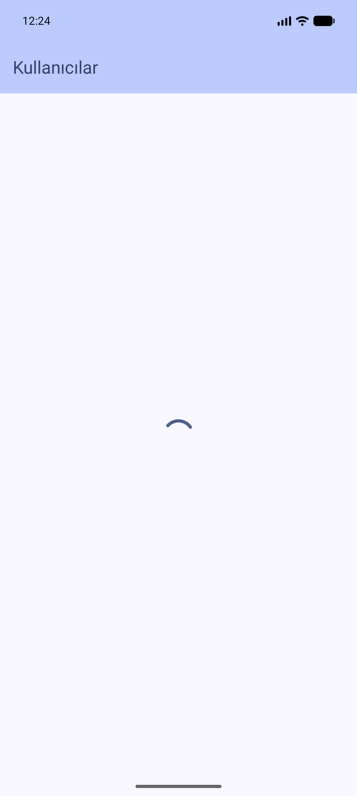
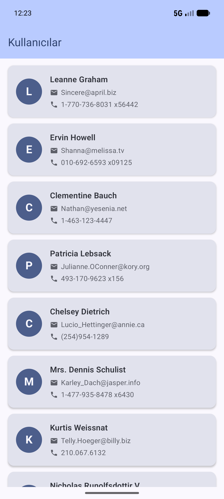
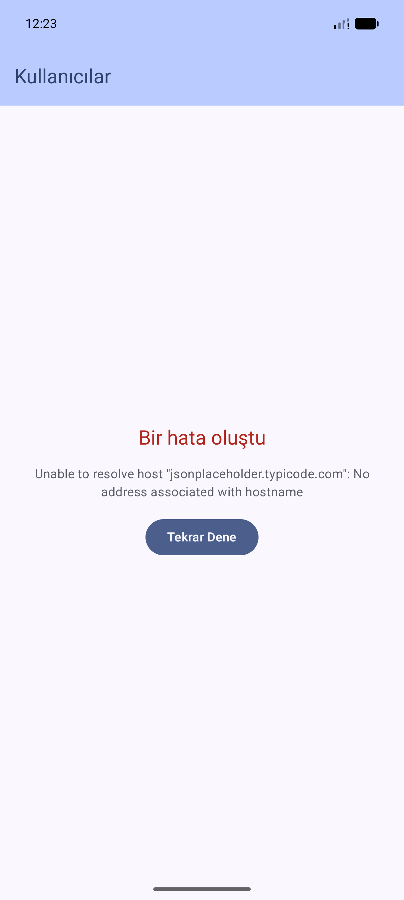

# MVVM User App

JSONPlaceholder **Users API**'den kullanıcı verisini çekip modern bir arayüzde listeleyen
Android uygulaması. Ders ödevi kapsamında **MVVM mimarisi**, **Retrofit**, **StateFlow** ve
**Jetpack Compose** konularını pratik etmek için geliştirilmiştir.

## Özellikler

- JSONPlaceholder `/users` endpoint'inden kullanıcı listesi çekme
- Üç aşamalı UI state yönetimi (`Loading`, `Success`, `Error`)
- Hata durumunda tek tuşla tekrar deneme
- Material 3 tasarım sistemi ve dark mode desteği
- İsmin baş harfini gösteren dairesel avatar ve `Card` + `Row` + `Column` yapısıyla
  temiz bir kullanıcı kartı tasarımı

## Kullanılan Teknolojiler

| Katman | Teknoloji |
|--------|-----------|
| Dil | Kotlin |
| UI | Jetpack Compose + Material 3 |
| Mimari | MVVM (Model - View - ViewModel) |
| State Yönetimi | `StateFlow` + `collectAsStateWithLifecycle` |
| Ağ | Retrofit 2 + Gson Converter |
| Eşzamanlılık | Kotlin Coroutines (`viewModelScope`) |
| Lifecycle | `lifecycle-viewmodel-compose`, `lifecycle-runtime-compose` |
| İkonlar | `material-icons-extended` |

## Proje Yapısı

```
com.ozkanfurkan.mvvmuserapp/
├── data/
│   ├── model/       → User.kt (data class)
│   ├── remote/      → ApiService.kt, RetrofitInstance.kt
│   └── repository/  → UserRepository.kt
├── ui/
│   ├── screen/      → UserListScreen.kt
│   ├── components/  → UserItem.kt
│   └── theme/       → Color.kt, Theme.kt, Type.kt
├── viewmodel/       → UserUiState.kt, UserViewModel.kt
└── MainActivity.kt
```

Katmanların sorumlulukları:

- **data/model** — API yanıtını temsil eden `User` veri sınıfı.
- **data/remote** — Retrofit arayüzü (`ApiService`) ve singleton Retrofit istemcisi
  (`RetrofitInstance`).
- **data/repository** — Veri kaynağı (şimdilik yalnızca uzak API) ile ViewModel
  arasında köprü görevi gören `UserRepository`.
- **viewmodel** — `UserUiState` sealed interface'i ve API çağrısını yönetip
  `StateFlow` yayınlayan `UserViewModel`.
- **ui/screen** — `Scaffold` + `TopAppBar` ile ana liste ekranı; state'e göre
  Loading / Success / Error içerikleri render edilir.
- **ui/components** — Tek kullanıcıyı gösteren `UserItem` bileşeni.

## Kurulum

### Gereksinimler

- Android Studio **Iguana** veya üzeri (AGP 8.5+ önerilir, proje AGP `9.1.1` ile hazırlanmıştır)
- Android SDK **36** (compile/target) — minimum SDK **24**
- JDK 11 veya üzeri
- İnternet bağlantısı

### Adımlar

1. Depoyu klonlayın:
   ```bash
   git clone <repo-url>
   cd MVVMUserApp
   ```
2. Android Studio'da projeyi **Open** ile açın; Gradle sync'i tamamlayın.
3. Emülatör veya fiziksel cihaz seçip **Run 'app'** ile çalıştırın.

Uygulama açıldığında otomatik olarak API çağrısı yapılır ve kullanıcılar listelenir.
Ağ hatası durumunda hata mesajı ve **Tekrar Dene** butonu gösterilir.

## API

- Base URL: `https://jsonplaceholder.typicode.com/`
- Endpoint: `GET /users`

İnternet izni `AndroidManifest.xml` içinde tanımlıdır:

```xml
<uses-permission android:name="android.permission.INTERNET" />
```

## Ekran Görüntüleri

<table>
  <tr>
    <th>Loading</th>
    <th>Success</th>
    <th>Error</th>
  </tr>
  <tr>
    <td></td>
    <td></td>
    <td></td>
  </tr>
</table>

## Geliştirme Notları

- API çağrısı `UserViewModel.fetchUsers()` içinde `viewModelScope.launch { ... }`
  bloğunda yapılır; hata yönetimi `try/catch` ile sağlanır.
- UI state tek bir `StateFlow<UserUiState>` üzerinden yayınlanır ve ekran tarafında
  `collectAsStateWithLifecycle` ile toplanır, böylece Compose yaşam döngüsüne
  uyumlu çalışır.
